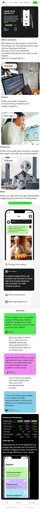

# Landing Page For AI Ally

## About
This is a project in which i was clonning a site advertiving a very strong AI technology called AI Ally, it is capable of handeling various activities going from school work for students to providing quick access to relevant information and offer data analysis for professionals at work. It also helps writers generate idears or even suggest improvements in writing style. The projectt is divided into 5 sections, which are the Hero section, the Destinations section, the Information section, the Testimonials and finally the footer.
## Opening the page
To open the page you need your mobile phone and you must be connected to the internet
## AI Ally web page
[App-Landing-Page](https://dribbble.com/shots/22834663-App-Landing-Page)
## Built with
- HTML
- CSS
## Live site
[link]https://github.com/JaffDavy/app-landing-page/pull/1
## Author
**Jaff Davy-Arnold**
- GitHub: [JaffDavy](https://github.com)
- X: [@jaff_arnold](https://twitter.com/jaff_arnold)